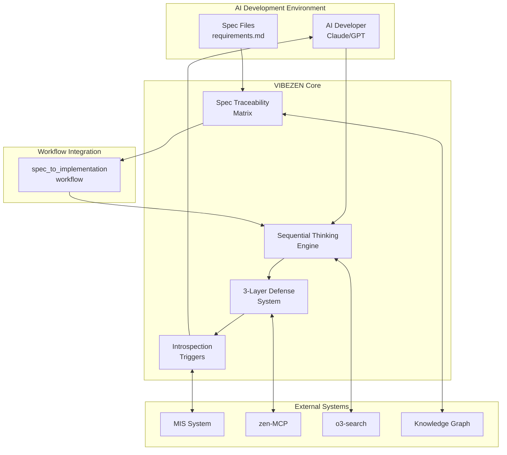

# VIBEZEN - 設計書

## アーキテクチャ概要

### システム構成図


### レイヤーアーキテクチャ
```
┌─────────────────────────────────────────┐
│         Integration Layer               │ ← 一気通貫ワークフロー統合
├─────────────────────────────────────────┤
│         Core Engine Layer               │ ← Sequential Thinking Engine
├─────────────────────────────────────────┤
│         Defense Layer                   │ ← 3層防御システム
├─────────────────────────────────────────┤
│         Tracking Layer                  │ ← トレーサビリティ管理
├─────────────────────────────────────────┤
│         External API Layer              │ ← MIS/zen-MCP/o3連携
└─────────────────────────────────────────┘
```

## コンポーネント設計

### 主要コンポーネント

#### 1. Sequential Thinking Engine (STE)
**責務**: AIの段階的思考プロセスを管理・強制
**インターフェース**:
```python
class SequentialThinkingEngine:
    async def think(
        self,
        problem: str,
        context_type: str,
        min_steps: int = 3,
        max_steps: int = 10,
        confidence_threshold: float = 0.7,
        allow_revision: bool = True,
        force_branches: bool = False
    ) -> ThinkingResult:
        """段階的思考を実行"""
        
    def evaluate_quality(self, result: ThinkingResult) -> QualityMetrics:
        """思考品質を評価"""
```

#### 2. Defense System Manager
**責務**: 3層防御の統合管理
**インターフェース**:
```python
class DefenseSystemManager:
    async def pre_validate(self, spec: Specification) -> ValidationResult:
        """事前検証: o3-searchで仕様意図分析"""
        
    async def monitor_runtime(self, event: CodeEvent) -> list[Violation]:
        """実装中監視: リアルタイム違反検出"""
        
    async def post_validate(self, code: str, spec: Specification) -> Report:
        """事後検証: 品質と準拠性評価"""
```

#### 3. Spec Traceability Matrix (STM)
**責務**: 仕様-実装-テストの関係性管理
**インターフェース**:
```python
class SpecTraceabilityMatrix:
    def add_mapping(
        self,
        requirement_id: str,
        code_ref: CodeReference,
        test_ref: Optional[TestReference] = None
    ) -> None:
        """要件とコードのマッピング追加"""
        
    def check_coverage(self) -> CoverageReport:
        """カバレッジレポート生成"""
        
    def detect_violations(self) -> list[SpecViolation]:
        """仕様違反（未実装・過剰実装）検出"""
```

#### 4. Introspection Trigger System
**責務**: パターン検出と内省の強制起動
**インターフェース**:
```python
class IntrospectionTriggerSystem:
    def register_trigger(
        self,
        pattern: TriggerPattern,
        action: Callable,
        priority: int = 0
    ) -> None:
        """トリガーパターン登録"""
        
    async def check_and_trigger(self, event: CodeEvent) -> list[TriggerResult]:
        """パターンチェックと内省起動"""
```

## データモデル

### エンティティ定義

#### 1. ThinkingTrace
```python
@dataclass
class ThinkingTrace:
    id: str
    problem: str
    steps: list[ThinkingStep]
    revisions: list[Revision]
    branches: list[Branch]
    final_decision: str
    confidence: float
    quality_metrics: QualityMetrics
    timestamp: datetime
```

#### 2. SpecViolation
```python
@dataclass
class SpecViolation:
    type: ViolationType  # UNIMPLEMENTED | OVER_IMPLEMENTED | DEVIATION
    requirement_id: Optional[str]
    code_reference: CodeReference
    description: str
    severity: Severity  # CRITICAL | HIGH | MEDIUM | LOW
    suggested_action: str
```

#### 3. QualityMetrics
```python
@dataclass
class QualityMetrics:
    depth_score: float  # 0.0-1.0
    revision_score: float  # 0.0-1.0
    branch_score: float  # 0.0-1.0
    confidence_progression: list[float]
    quality_grade: str  # A-F
    thinking_time: float  # seconds
```

### データフロー
```
仕様 → STE（理解） → 実装計画 → Defense（検証） → コード生成
  ↓                                              ↓
 STM ← ← ← ← ← ← ← ← ← ← ← ← ← ← ← ← ← ← ← ← ←
  ↓
Knowledge Graph（永続化）
```

## 統合インターフェース

### 一気通貫ワークフロー統合
```python
class VIBEZENWorkflowHook:
    """spec_to_implementation_workflowへの統合ポイント"""
    
    async def on_spec_loaded(self, spec: Specification) -> None:
        """仕様読み込み時: 事前検証開始"""
        
    async def on_implementation_start(self, spec: Specification) -> None:
        """実装開始時: Sequential Thinking起動"""
        
    async def on_code_generated(self, code: str, spec: Specification) -> None:
        """コード生成時: 実時間監視"""
        
    async def on_test_generated(self, tests: str, spec: Specification) -> None:
        """テスト生成時: トレーサビリティ更新"""
        
    async def on_completion(self, result: WorkflowResult) -> QualityReport:
        """完了時: 総合品質レポート生成"""
```

## 設定管理

### vibezen.yaml
```yaml
vibezen:
  # Sequential Thinking設定
  thinking:
    min_steps:
      spec_understanding: 5
      implementation_choice: 4
      test_design: 3
    confidence_threshold: 0.7
    allow_revision: true
    
  # 防御レベル設定
  defense:
    pre_validation:
      enabled: true
      use_o3_search: true
    runtime_monitoring:
      enabled: true
      real_time: true
    post_validation:
      enabled: true
      strict_mode: false
      
  # トリガー設定
  triggers:
    hardcode_detection:
      enabled: true
      patterns:
        - 'port\s*=\s*\d+'
        - 'password\s*=\s*["\']'
    complexity_threshold: 10
    
  # 外部連携
  integrations:
    mis:
      enabled: true
      event_types: ['code_generated', 'spec_violation']
    zen_mcp:
      enabled: true
      commands: ['codereview', 'challenge', 'refactor']
```

## エラーハンドリング

### エラーコード体系
- `VZEN-001`: Sequential Thinking失敗
- `VZEN-002`: 仕様理解不足
- `VZEN-003`: 過剰実装検出
- `VZEN-004`: ハードコード検出
- `VZEN-005`: 外部API通信エラー

### 復旧戦略
- 思考失敗時: 人間への確認要求
- API障害時: ローカルキャッシュ利用
- 検証失敗時: 段階的ロールバック

## パフォーマンス設計

### 最適化戦略
- **並列処理**: 3層防御を非同期実行
- **キャッシング**: 仕様分析結果を再利用
- **バッチ処理**: STM更新をバッチ化
- **遅延評価**: 必要時のみ詳細分析

### ベンチマーク目標
- 思考ステップ: < 2秒/step
- 全体オーバーヘッド: < 10%
- メモリ使用量: < 500MB

## テスト設計

### テスト戦略
- **単体テスト**: 各コンポーネント90%カバレッジ
- **統合テスト**: ワークフロー統合シナリオ
- **性能テスト**: 大規模プロジェクトでの負荷試験
- **回帰テスト**: 失敗パターンの再現防止

### モックとスタブ
- AI応答のモック化
- 外部API（o3-search、zen-MCP）のスタブ
- Knowledge Graphのインメモリ実装

## 更新履歴
- 2025-07-23: 初版作成（アーキテクチャ設計完了）